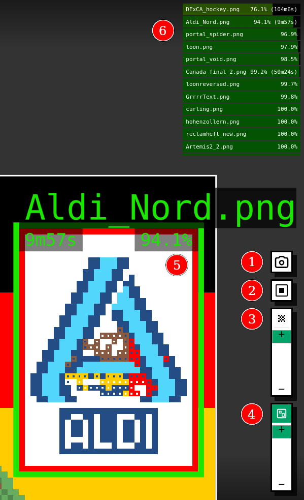

# Overlay Plus
### Was ist das Overlay?
Das Overlay zeigt dir an, wo falsche Pixel sind, damit du richtige setzen kannst. Es setzt keine Pixel für dich.

#### Was unterscheidet dieses Overlay vom normalen?
   - "Neue" Overlay-Optionen: kleine Pixel, große Pixel oder das Originalbild
   - Neuer Slider für die Transparenz des ganzen Canvas (roter Slider) unter dem Slider für die Tranzparenz des Overlays (grüner Slider)
   - Screenshot-Button default aus, kann über Konsole aktiviert werden
   - Gerade ist nur das "advanced" Overlay bearbeitet, das normale ist unverändert

Direktlinks:  
[Installation](#overlay-installieren)  
[Updates](#overlay-updaten)  
[Wie funktioniert das Overlay?](#wie-funktioniert-das-overlay)  
[FAQ](#faq)  
----
## Overlay installieren

1. https://www.tampermonkey.net/ öffnen
   
   

2. Unter "Download" mit "Gehe zum Store" das Plugin installieren -> Weiterleitung zu den App-Stores dort installieren
   
   

3. **WICHTIG: Wenn du Chrome/Opera/Edge/Brave oder einen anderen Chromium-basierten Browser nutzt:**

   Geh auf die Chrome Erweiterungseinstellungen ([about://extensions](about://extensions)) und aktiviere oben rechts den Schalter für den Entwicklermodus.
   Klicke dann bei Tampermonkey auf "Details" und, wenn die Option da ist, erlaube Tampermonkey, Nutzerscripts zu installieren.

4. Anschließend auf einen der folgenden Links klicken, um das jeweilige Overlay zu installieren, Tampermonkey sollte sich automatisch öffnen (wenn du dich nicht entscheiden kannst, findest du die Unterschiede [hier](#wie-funktioniert-das-overlay)):
   - [Normales Overlay](https://github.com/randomalex221/place-overlay-plus/raw/main/src/scripts/placeDE-overlay.user.js)  
   - [Erweitertes Overlay](https://github.com/randomalex221/place-overlay-plus/raw/refs/heads/main/src/scripts/advanced_overlay.user.js)

5. Nun drückt ihr in Tampermonkey nur noch auf "Updaten" oder "Neu installieren".  
Das Ganze sieht dann in Tampermonkey (abhängig von der gewählten Variante) ungefähr so aus:
   
   

------

## Overlay updaten
Um das Overlay auf eine neue Version zu aktualisieren (nicht die Daten, sondern das Skript) klickt ihr einfach oben bei 4. auf den entsprechenden Link.

--------

## Wie funktioniert das Overlay?
### Normale Variante:
Nach dem Installieren siehst du auf der r/place Leinwand kleinere "Pixel" innerhalb der tatsächlichen Pixel. Diese kleineren Pixel geben dir an, welche Farbe der Pixel haben sollte:

### Erweiterte Variante:

Der Kamera Button (1) erstellt ein Screenshot vom gesamten Canvas.

Mit dem Knopf unten rechts (2) kann man zwischen mehreren Modi wechseln:
1. - Kleine Pixel (wie im normalen Overlay);
   - Dies ist der Standardmodus, welcher bei jedem Neuladen der Seite aktiv ist
   - 

2. - Volle Pixel, d.h. man sieht wie das Bild aussehen sollte und falsche Pixel werden vollständig überdeckt
   - Dieser Modus eignet sich sehr gut, wenn man das ganze Bild ohne Fehler sehen will
   - 

Welcher Modus aktiv ist, erkennt man am Icon und anhand vom Tooltip des Buttons (2).

Außerdem gibt es unter dem Button einen Schieberegler (3).
Dieser regelt, wie "durchscheinend" das Overlay sein soll.
Auf der ganz unteren Position ist das Overlay komplett durchsichtig.

------------

## FAQ

### Wieso ist die Flagge nicht im Overlay?
Die Flagge ist relativ simpel und klar abgegrenzt.
Somit kann jeder - auch Leute ohne Overlay - die Flagge reparieren.
Wir nutzen die verfügbaren Pixel der Leute, die das Overlay installiert haben, lieber um die komplizierteren Artworks zu schützen, die man nicht so einfach ohne irgendwelche Anweisungen wie z.B. das Overlay reparieren kann.

### Wieso funktioniert das Overlay nicht?
Falls das Overlay nicht funktioniert stelle bitte folgende Sachen sicher:
- Lade die Seite einmal neu, eventuell wurde das Skript einfach nur nicht geladen.
- Zoome einmal in das Canvas auf Höhe des r/placeDE-Bereichs herein, da es sein kann, dass das Overlay erst bei etwas Zoom deutlich sichtbar wird.
- In den ersten Versionen kam es bei manchen Browsern in Kombination mit einem eingeschalteten Darkmode zu Komplikationen. Bitte update das Skript für das Overlay oder deaktiviere den Darkmode.
- Falls du noch einen anderen Browser hast, probiere bitte einmal diesen Browser.
- Falls alles nicht hilft, frage bitte im tech-support nach, vielleicht hatte dort jemand das gleiche Problem.

### Wieso aktualisiert sich mein Overlay nicht?
Eventuell hast du noch die alte Overlay-Version, probiere einmal das Skript für das Overlay neu zu installieren.
Danach sollte sich das Overlay automatisch alle 30 Sekunden updaten.
Falls das nicht klappt, muss die Seite leider manuell neu geladen werden, um ein Update zu erhalten.
Danach sollte es sich wieder selbst aktualisieren (eventuell sorgen aber auch andere Erweiterungen dafür, dass nur durch Neuladen der Seite neue Pixelarts angezeigt werden können).

### Wie kann ich das Overlay auf dem Handy nutzen?
Ne, leider ist das nicht möglich und wird auch in Zukunft nicht möglich sein.

### Wieso ist der Pixel im Overlay falsch?
Das liegt daran, dass die Vorlage einen Fehler enthält.
Um das zu beheben, muss sich ein Designer an die Vorlage setzen und sie reparieren.

### Setzt das Overlay automatisch Pixel?
Nein, das ist nicht der Zweck des Overlays.
Das Overlay ist nur als Hilfe zum Pixeln gedacht.
Bei Interesse findest du [hier](https://place.army/) weitere Informationen.
